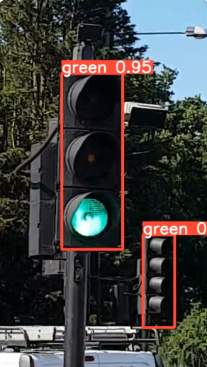
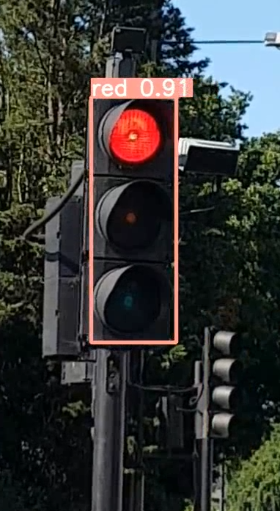
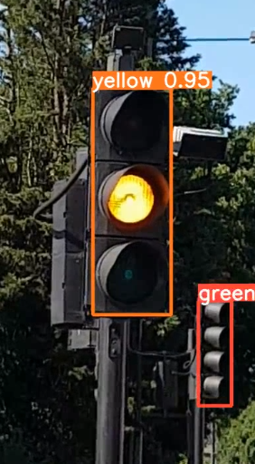

# Traffic_signal_detection_app_using_YOLOV5

This project is an **Android application** developed using **Android Studio (Java)** and a **YOLOv5 model** for real-time traffic signal detection.  
The app is designed to detect **Green, Yellow, and Red traffic lights** directly from the mobile camera feed.  

---

## ✨ Features  
- Real-time traffic signal detection using **YOLOv5**  
- Detects **Green, Yellow, Red signals**  
- Can be extended for **smart traffic systems**  

---

## ⚙️ Tech Stack  
- **Android Studio (Java)**  
- **YOLOv5 (TFLite conversion)**  
- **TensorFlow Lite for Android inference**  

---

## 📷 Screenshots  

  
  
  

---

## 🚧 Known Issues  
- On some devices, the **camera turns off unexpectedly** after launch.  
- This may be related to **TensorFlow Lite GPU delegate / device compatibility**.  
- Future work: Fix camera stability and optimize performance.  

